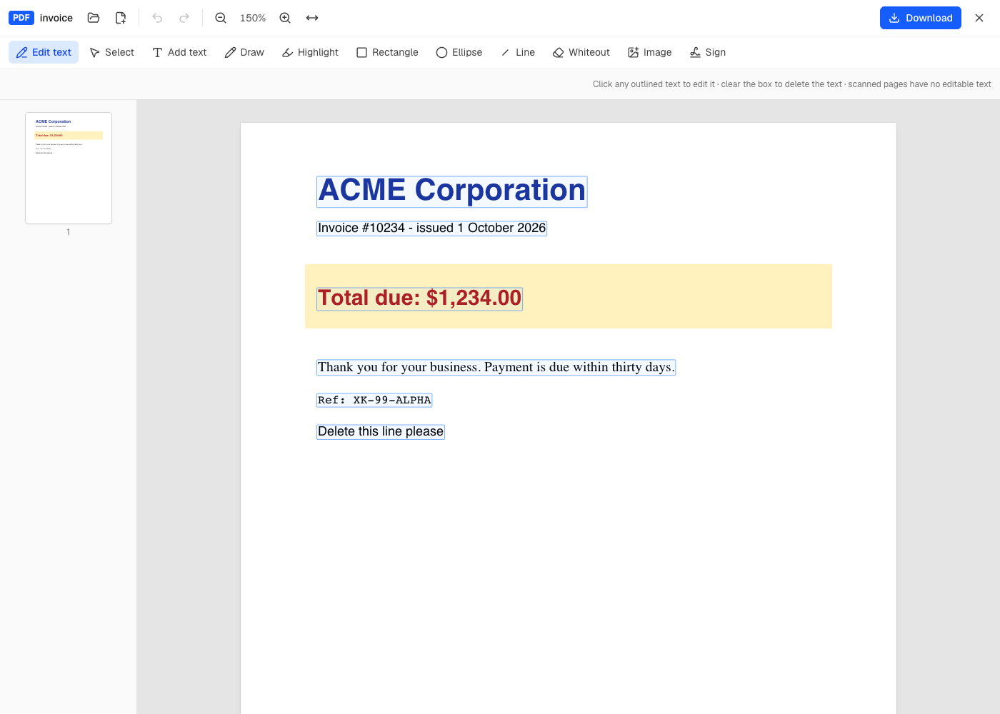
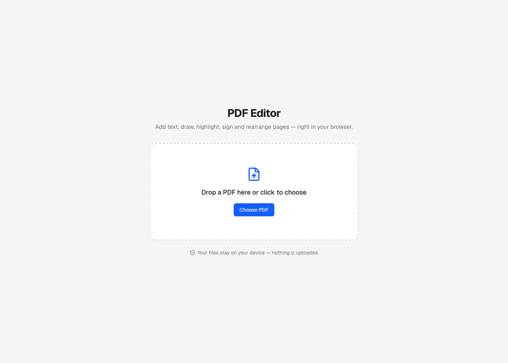
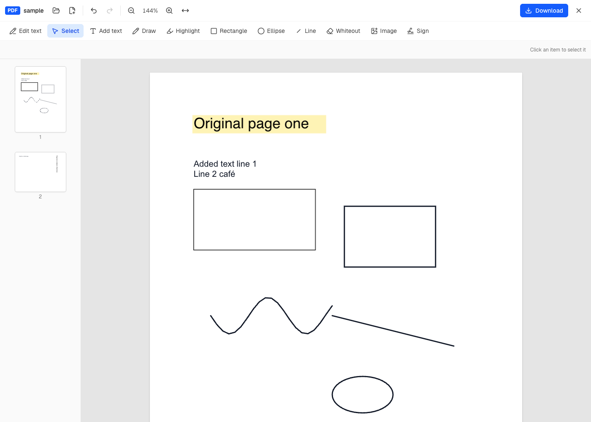
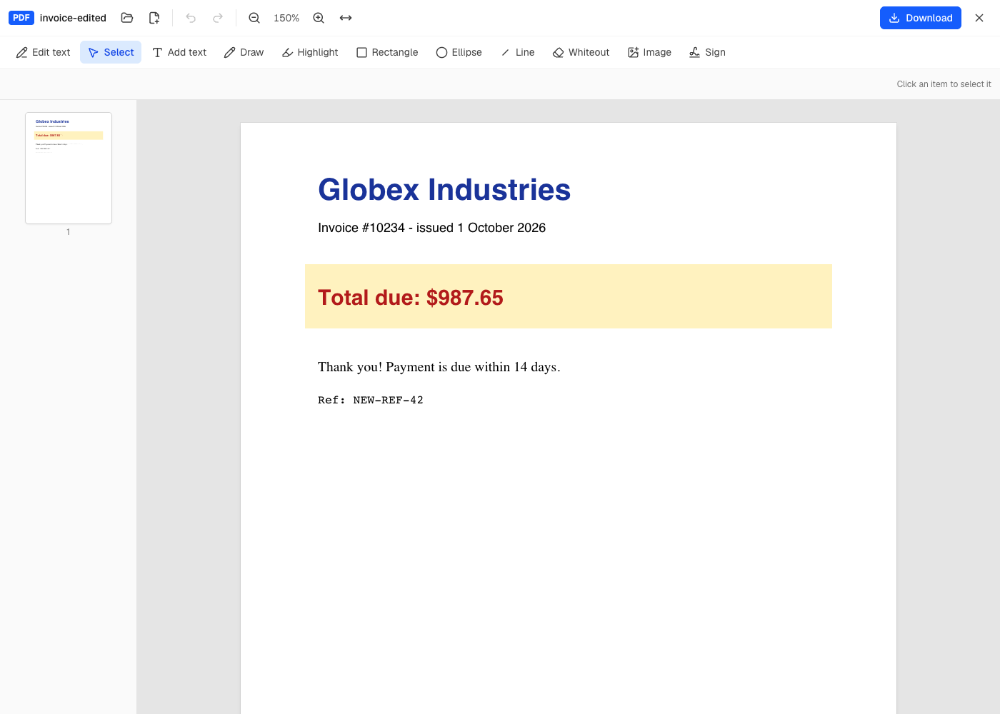
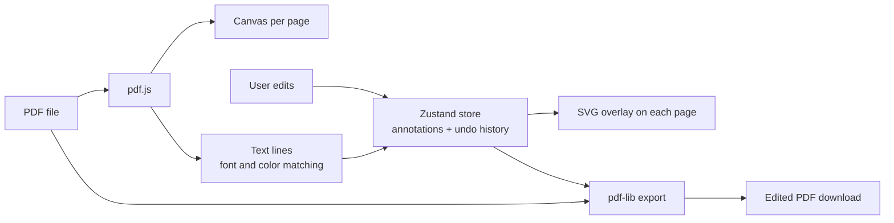

# PDF Editor

A browser-based PDF editor built with **Next.js**, **React** and **TypeScript**. Open a PDF, edit its existing text, add text, drawings, highlights, images and signatures, rearrange and merge pages, then download the result. Everything runs in your browser, so your files are never uploaded to a server.


**Live demo:** _add your deployed URL here_



---

## Contents

- [Features](#features)
- [Screenshots](#screenshots)
- [Tech stack](#tech-stack)
- [How it works](#how-it-works)
- [Getting started](#getting-started)
- [Deployment](#deployment)
- [Keyboard shortcuts](#keyboard-shortcuts)
- [Project structure](#project-structure)
- [Limitations](#limitations)
- [Roadmap](#roadmap)
- [License](#license)

## Features

**Edit existing text**
- Click any line of text in the PDF and retype it
- Automatically matches the original's font family, size, bold/italic, text color and background color
- Clear a line to delete it

**Annotate**
- Add text: Helvetica, Times or Courier, with size, bold, italic, color and multiple lines
- Freehand drawing, rectangles, ellipses and lines, with adjustable color, width and fill
- Highlighter with a multiply blend, so the text underneath stays readable
- Whiteout to cover any area of the page
- Insert images (PNG and JPEG; other formats are converted automatically)
- Draw a signature and place it anywhere

**Edit and arrange**
- Select, move, resize and restyle anything you've added
- Undo and redo for every change
- Rotate, delete and reorder pages (drag the thumbnails), and merge in other PDFs
- Zoom and fit-to-width; thumbnails update live as you edit

**Private by design**
- No backend: PDFs are read, edited and saved entirely on the client
- Download the result as a standard PDF that opens in any viewer

## Screenshots

| Start screen | Annotating a page |
| --- | --- |
|  |  |

| Edit text mode (every line is clickable) | Downloaded result |
| --- | --- |
|  |  |

## Tech stack

| Area | Technology |
| --- | --- |
| Framework | [Next.js 15](https://nextjs.org/) (App Router), [React 19](https://react.dev/) |
| Language | [TypeScript](https://www.typescriptlang.org/) |
| Styling | [Tailwind CSS 4](https://tailwindcss.com/), [Lucide](https://lucide.dev/) icons |
| PDF rendering and text extraction | [pdf.js](https://mozilla.github.io/pdf.js/) (`pdfjs-dist`) |
| PDF writing | [pdf-lib](https://pdf-lib.js.org/) |
| State management | [Zustand](https://zustand.docs.pmnd.rs/) |

## How it works



1. **Rendering.** pdf.js draws each page onto a canvas. Pages render lazily as they scroll into view, so large documents stay fast. An SVG layer on top of each page shows the edits and handles mouse input.
2. **One coordinate system.** Every edit is stored in PDF points relative to the page's unrotated top-left corner. Zooming, rotating pages and exporting all reuse the same data, and text added to a rotated page is counter-rotated so it reads upright.
3. **Editing existing text.** PDFs don't store paragraphs, only positioned text fragments. [`lib/textLines.ts`](lib/textLines.ts) groups pdf.js text items into lines, splitting them wherever the style changes. It picks the closest standard font from the embedded font's name, falling back to comparing text widths. It then samples the rendered canvas for the background and text colors. The original line is covered with a box in the background color and the new text is drawn on top.
4. **History.** The store keeps immutable snapshots of pages and edits for undo and redo. Continuous actions, such as dragging or sliding a color picker, are merged into a single undo step.
5. **Export.** [`lib/exportPdf.ts`](lib/exportPdf.ts) uses pdf-lib to copy the original pages (in their new order and rotation) into a new document and draw every edit into them. The original page content is first wrapped in its own graphics state, so leftover transforms in a source file can't shift the new content.

## Getting started

### Prerequisites

- [Node.js](https://nodejs.org/) 18.18 or later (20+ recommended)
- npm

### Installation

```bash
git clone https://github.com/mbasamahmad/pdf-editor.git
cd pdf-editor
npm install
```

`npm install` also runs a `postinstall` script that copies the pdf.js worker into `public/`.

### Run locally

```bash
npm run dev
```

Open [http://localhost:3000](http://localhost:3000) and drop in a PDF.

### Available scripts

| Command | Description |
| --- | --- |
| `npm run dev` | Start the development server |
| `npm run build` | Create a production build |
| `npm run start` | Serve the production build |
| `npm run lint` | Run ESLint |

> **Note:** don't run `npm run build` while `npm run dev` is running in the same folder. Both write to `.next`, and the dev server will break. If that happens, stop the server, delete `.next` and start it again.

## Deployment

The app is fully static on the client and needs no environment variables or backend, so it deploys anywhere that supports Next.js.

**Vercel (recommended):**
1. Push the repository to GitHub.
2. Go to [vercel.com/new](https://vercel.com/new) and import the repository.
3. Keep the default settings and click **Deploy**.

Then add the deployed URL to the **Live demo** line at the top of this README.

## Keyboard shortcuts

| Key | Action |
| --- | --- |
| `E` | Edit existing text |
| `V` | Select / move |
| `T` | Add text |
| `P` | Draw |
| `H` | Highlight |
| `R` / `O` / `L` | Rectangle / Ellipse / Line |
| `W` | Whiteout |
| `Delete` / `Backspace` | Delete the selected item |
| Arrow keys (`Shift` for bigger steps) | Nudge the selected item |
| `Ctrl/⌘ + Z` | Undo |
| `Ctrl/⌘ + Shift + Z` or `Ctrl + Y` | Redo |
| `Esc` | Finish editing / back to Select |

## Project structure

```
├── app/
│   ├── layout.tsx            # Root layout and metadata
│   ├── page.tsx              # Loads the editor on the client only
│   └── globals.css
├── components/
│   ├── Editor.tsx            # App shell: start screen, file handling, shortcuts, download
│   ├── Toolbar.tsx           # Tools, style controls, undo/redo, zoom
│   ├── PdfCanvas.tsx         # Lazy pdf.js page rendering
│   ├── AnnotationLayer.tsx   # SVG overlay: drawing, selecting, moving, text editing
│   ├── Thumbnails.tsx        # Page sidebar: reorder, rotate, delete
│   └── SignatureModal.tsx    # Signature pad
├── lib/
│   ├── store.ts              # Zustand store: pages, annotations, undo/redo
│   ├── types.ts              # Shared types
│   ├── geometry.ts           # Coordinate transforms, rotation, text measuring
│   ├── textLines.ts          # Text extraction, font matching, color sampling
│   ├── exportPdf.ts          # Writes the edited PDF with pdf-lib
│   └── pdfjs.ts              # Loads pdf.js and reads documents
├── scripts/
│   └── copy-pdf-worker.mjs   # Copies the pdf.js worker into public/
└── docs/screenshots/         # Images used in this README
```

## Limitations

- **Edited text covers the original; it doesn't remove it.** The old text is still in the file under the cover and can be found by copying or searching, so don't use this to redact sensitive information.
- Edited and added text uses the standard PDF fonts (Helvetica, Times and Courier). Unusual fonts will look slightly different, and characters outside the Latin (WinAnsi) set are replaced with `?`.
- Replacement text that's longer than the original doesn't push the rest of the line along.
- Only horizontal text can be edited. Scanned PDFs have no text layer to edit.
- Password-protected PDFs aren't supported.

## Roadmap

- [ ] Embed custom fonts so non-Latin scripts (e.g. Arabic, Urdu, Chinese) work
- [ ] True redaction that removes the underlying text
- [ ] Fill in PDF form fields
- [ ] OCR for scanned documents
- [ ] Copy/paste and multi-select for annotations
- [ ] Dark mode

## License

Released under the [MIT License](LICENSE).

## Author

**Basam Ahmad**: [GitHub @mbasamahmad](https://github.com/mbasamahmad)

If you find this project useful, consider giving it a ⭐ on GitHub.
